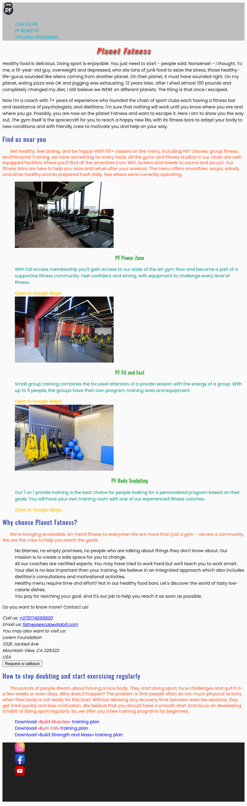

# longread-2-module2-introduction-to-css-practice-3(1-30)

<!-- AUTOGEN:STATS -->
     

## 📸 Latest Screenshot

<!-- END:AUTOGEN -->

Page of the gym network! 

# todo:

1. Connect to HTML file an external style table, the path to which ./css/styles.css.In the CSS Editor tab, add two CSS rules for H1 and P tags.In the styles file, set the text color color with Orange values for the title and Cyan for the paragraph.
2. Add the links to the links for links in which the color of the text of the links on Black.
3. Add a Header Tag Tag File, in which the color of its background is changed on WhitesMoke.
4. Changes in color value in the style file on RGB.Instead of WhitesMoke, use color 245, 245, 245 instead of black grounds 0, 0, 0, 0
5. Changes in color value in the style file to Hexadecimal format.Use color #F5F5F5 for the Heder background, and for the text of the links #212121.
6. Add the Rule with NAV selector to the style file.Use the RGBA () function and set the color of Nav Blue Blue with a transparency of 0.3.
7. Let's start with the design of the text content of headings and references.Add the text color to the tag selector.  
   лектора тега.

- add h1 tags #F44336;
- add h2 tags #3F51b5;
- Add h3 tags #4CAF50;
- Add tags a color #FFC107.

8. Use the ID selector to change the color in the header text.

- the color of the title with ID = "hero" should become #3F51B5
- the color of the title with ID = "Clubs" should become #9C27B0
- the color of the title with ID = "BeneFits" should become #00bcd4
- Title Color with ID = "PROGRAMS" should become #ff9800

9. On the HTML code tab, we have added the items to the Class Attribute: Tagh Header, H1, H2, P in Sections, Footer and P on foot.

## For other tags add rules with class selector and the following properties:

- Heder's color background #bdbd
- The color of the text in items with the Section-Text class on #FF5722
- In Ladin Color Background #212121
- the color of text in foot #ffffff
- Colier of the text of Page Title #F44336
- Text Colier Headers Section #3F51B5

10. On the HTML code tab, we added the list and its elements in the club section of the Class Attribute.Use the selectors of the descendant with classes in the .Class1 .Class2.

## Add the rules with the following properties to the items:

- Color of text in the title of the items of the list #4CAF50
- The color of the text in paragraphs of the list of list #009688
- text color in list items #FFC107

11. Add CSS rules for the hover effect on page links.Use the selectors of the descendant with classes in the .Class1 .Class2.

## When hover the link should change color:

- Lear inside Page-Nav change color to #18ffff
- Chit inside Club-List change color to #F57F17

12. Add CSS rules for the effect of active links.When clicking the link should change color:

- link inside Page-Nav change color to #212121
- link inside club-List change color to #FF1744

13. Add CSS rules for the reference focus effect.When navigating from the keyboard, the links should change color:

- link inside Page-Nav change color to #18ffff
- Link inside Club-List change color to #F57F17
- Be sure to use the syntax of the selector listing! Set the first level header font with Georgia.Do not forget to specify a family with a shabby font if the user suddenly does not have a Georgia font.

14. Set the first level header font with Georgia.Do not forget to specify family fonts with a shab Georgia.
15. Set the basic font of the document in CSS Rules with Body Selector.Here is a list of possible fonts that we need to use.

- "Helvetica Neue", "Roboto", "Verdana", Sans-Serif

16. Set the font size of page elements.Supplement the code already existing CSS rules and create new ones as needed.Use classrooms and offspring.

- H1 title text should be 24px size
- H2 headers should be 20px size
- H3 titles should be 16px size
- links in the club section should be 14px size

17. Set the weight of the headline font and links of the club section.Supplement the existing CSS code.

- H1 title text should be 500 weighing
- H2 titles should be 500 weighing
- text text in the club section should be 500 weighing

18. Set the H1 header to the course image of the font.

19. The Head tag connects two POPPINS fonts - this will be the main font of the document and OSWALD - heading font.Changes in Font-Family for Body tag on "Poppins", Sans-serif, and set all the headers of "Oswald", Sans-serif.Use existing CSS rules.

20. Give the property of Text-Decoration and stylize the link.Adjust the link in the Club-List Club section section so that they are initially under emphasis, but when you draw or focus, the underlining keyboard appeared.

21. Let's deal with navigation references.The entire text of the heder navigation references should be in uppercase and have a font of 14px.

22. Centrify the text of the headings of the first and third levels.Use existing CSS rules.

23. Dear the line interval 1.333 to all headings and 1.5 text with the Section-Text class.Use existing CSS rules and add new as needed.

24. Set the main heading of the page inter -directional interval in 3px, and the headers of sections - 1px.Use already existing CSS rules.

25. Set the text sections of the first line of text 24px.Use existing CSS rules.

26. Set the first level header with the following characteristics:

- a 2px horizontal displacement
- a vertical displacement 2px
- Radius blur 4px
- Shadow color #212121

26. There is a task to make a workout plan in the Download List in a different color.To do this, in the HTML editor, we used the Span Tag with the Plan-Name class and turned them the name of the training plan.Your task, in the CSS editor, add a rule with a descendant selector and change the color of the item with the Plan-Name class to #FF1744.

27. Set the basic color of the document text in Body tag with value #212121, as well as the text of the document 14px.

28. Set the background color of the document in Body Tag with #FAFAFA value.

29. Set the main row interval of a document text in a Body tag with a value 1.5.

30. All the headings of our document use the same Oswald font.In order not to duplicate the advertisement of the font family in different CSS rules for each heading, add the rule of all types of titles from H1 to H6 and set the font family in it.Do not forget to delete the property of announcing the font family from class selectors for headlines.
