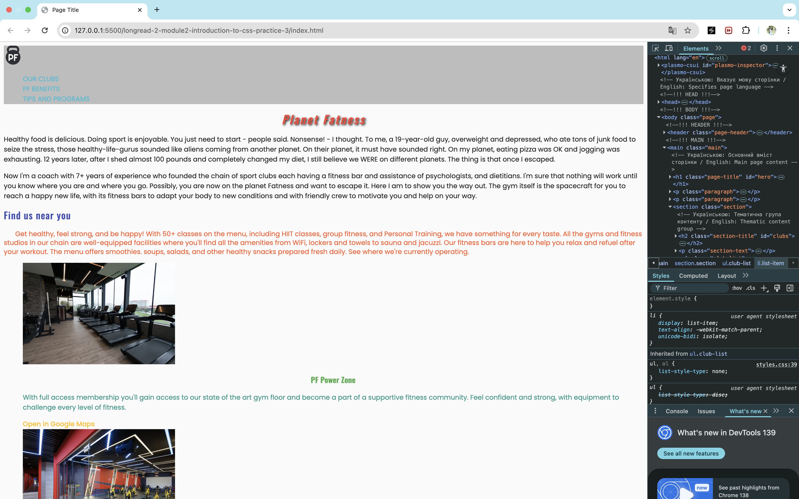

# longread-2-module2-introduction-to-css-practice-3-4

Page of the gym network!

# todo:

1. Connect to HTML file an external style table, the path to which
   ./css/styles.css.In the CSS Editor tab, add two CSS rules for H1 and P
   tags.In the styles file, set the text color color with Orange values for the
   title and Cyan for the paragraph.
2. Add the links to the links for links in which the color of the text of the
   links on Black.
3. Add a Header Tag Tag File, in which the color of its background is changed on
   WhitesMoke.
4. Changes in color value in the style file on RGB.Instead of WhitesMoke, use
   color 245, 245, 245 instead of black grounds 0, 0, 0, 0
5. Changes in color value in the style file to Hexadecimal format.Use color
   #F5F5F5 for the Heder background, and for the text of the links #212121.
6. Add the Rule with NAV selector to the style file.Use the RGBA () function and
   set the color of Nav Blue Blue with a transparency of 0.3.
7. Let's start with the design of the text content of headings and
   references.Add the text color to the tag selector.  
    лектора тега.

- add h1 tags #F44336;
- add h2 tags #3F51b5;
- Add h3 tags #4CAF50;
- Add tags a color #FFC107.

